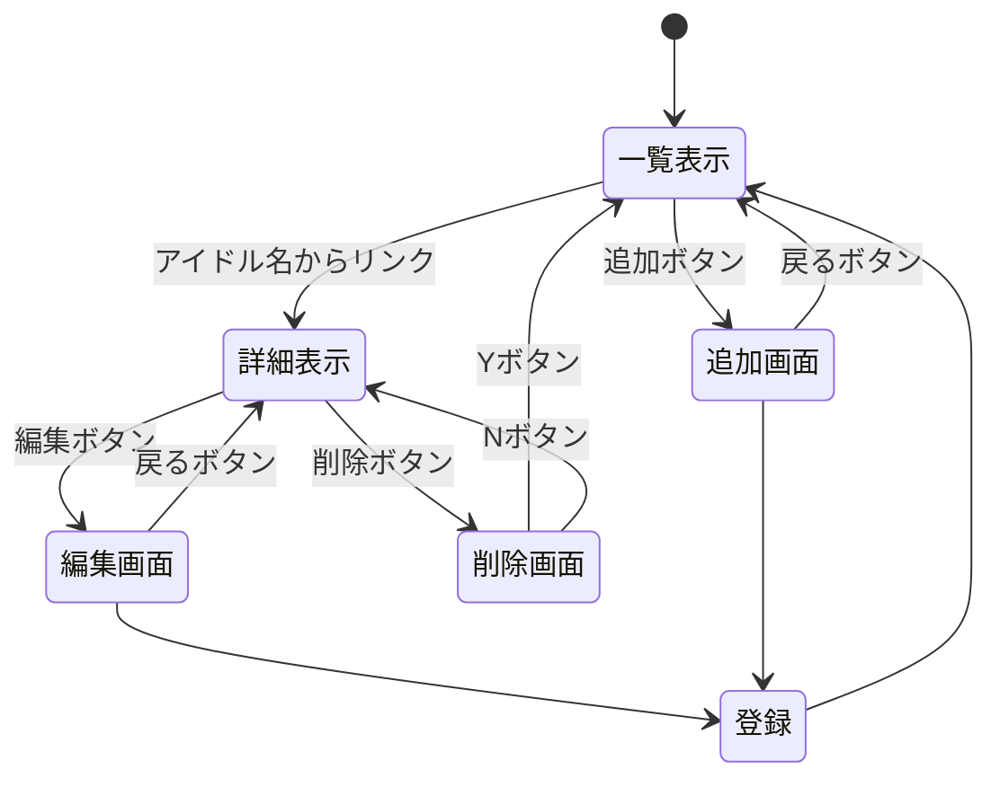

# 開発者用仕様書

####　在学アイドル
##### データ構造
リスト+オブジェクト
- id:（信号機以外50音順）数値：
- name：文字列：名前
- age：数値：
- size：数値：身長
- weight：数値：体重
- song：数値：持ち曲数
- period：文字：実装時期
- explanation：文字列：キャラ説明
- ：
##### ページ構造
- 一覧:タイトル，校章上表示，id,period,name一覧中央表示，追加ボタン上下表示
- 詳細:id,name,size,weight,therrsize,song,period,explanation中央表示，一覧に戻る,編集削除ボタン下表示
- 追加:リスト入力欄中央表示，送信ボタン下表示，一覧に戻るボタン下表示
- 削除:本当に削除しますかYorNボタン中央表示
- 編集:リスト編集欄，戻るボタン，決定ボタン
##### ページ遷移

####　ピックアップアイドル
##### データ構造
リスト+オブジェクト
- id:数値:キャラ追加順
- name:文字列:開催ガチャ名
- day:文字列:開催期間
- level:数値:評価
- songname:名前:曲名
##### ページ構造
- 一覧:タイトル，十王邦夫表示，id,name，追加削除ボタン上下表示
- 詳細:id,name,day,level,songname中央表示，曲URL，一覧に戻るボタン下表示
- 追加:リスト入力欄中央表示，送信ボタン下表示，一覧に戻るボタン下表示
- 削除:本当に削除しますかYorNボタン中央表示，一覧に戻るボタン下表示
##### ページ遷移
- :
- :
- :

####　DMデッキ
##### データ構造
リスト+オブジェクト
- id:
- name:
- :
##### ページ構造
- 一覧:タイトル，校章上表示，キャラ名一覧中央表示，追加削除ボタン上下表示
- 詳細:リストのデータ中央表示，一覧に戻るボタン下表示
- 追加:リスト入力欄中央表示，送信ボタン下表示，一覧に戻るボタン下表示
- 削除:本当に削除しますかYorNボタン中央表示，一覧に戻るボタン下表示
##### ページ遷移
- :
- :
- :